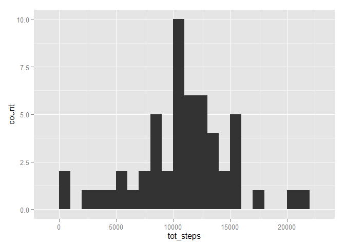
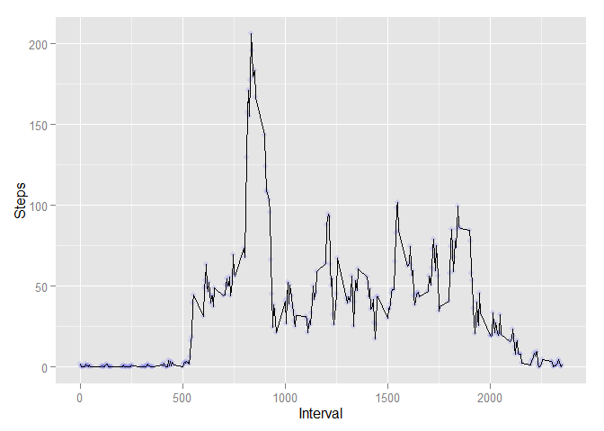
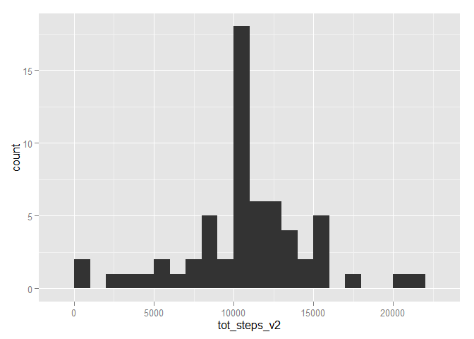

# Reproducible Research: Peer Assessment 1

In this project, we report on our findings regarding the supplied activity data. 
This data is available in the current Git

## Loading and preprocessing the data
1) First we need to unzip and read in the data: 

```r
unzip("activity.zip")

activity_data <- read.csv("activity.csv")
```

2) Now we clean it up

```r
ad_flag <- complete.cases(activity_data)
clean_data <- activity_data[ad_flag, ]
```

## What is mean total number of steps taken per day?

In order to get to grips with the data, we first get the column names:

```r
colnames(clean_data)
```

```
## [1] "steps"    "date"     "interval"
```

We want the total number of steps taken each day, and can get it using the following code:

```r
tot_steps <- tapply(clean_data$steps,clean_data$date, sum)
Date <- unique(activity_data$date)
tot_table <- data.frame(Date,tot_steps)
```


1) Now we make can make a histogram of the number of steps taken per day ,  using ggplot2.  


```r
library(ggplot2)
qplot(tot_steps,data =tot_table,binwidth = 1000) 
```

 

2) We can now get the mean and median number of steps using the following (excluding null data):

```r
mean_steps <- as.integer(mean(tot_steps,na.rm=TRUE))
median_steps <- as.integer(median(tot_steps,na.rm=TRUE))
```
Hence the mean is 10766, while the median is 10765. I made the mean an integer because the formatting was weird otherwise.

## What is the average daily activity pattern?
1) For this part  we are intereested in plotting the average number of steps taken for each 5 minute interval over the observation period. This requires 
getting the means for each of the 288 intervals:

```r
Steps <- tapply(clean_data$steps, clean_data$interval,mean)
```
Next we make a new table giving interval and mean number of steps:

```r
Interval <- activity_data[1:288,3]
mean_data <- data.frame(Interval,Steps)
```

Finally we can plot the data

```r
ggplot(mean_data, aes(Interval,Steps)) + geom_point(size=2,color="blue",alpha=0.1) + geom_line()
```

 

2) We can find the interval where most steps were taken using

```r
max_interval <- mean_data[mean_data$Steps==max(Steps),1]
```
and getting a value of 835.

## Imputing missing values

1) We need to calculate the number of rows with no values (NAs). We can do this as follows

```r
bad_flag <- is.na(activity_data$steps)
bad_data <- activity_data[bad_flag,]
num_na <- length(bad_data$steps)
```
Hence, there are 2304 records with NA.

2) We can replace any NA values with the mean value for that interval. To do that, we will make a new table
which repeats the mean value for every day in the dataset

```r
All_dates <- activity_data$date
All_intervals <- activity_data$interval
All_steps <- activity_data$steps
temp_table <- cbind(Steps,Date)
```

```
## Warning in cbind(Steps, Date): number of rows of result is not a multiple
## of vector length (arg 2)
```

```r
repeated_mean <- temp_table[,1]
new_table <- data.frame(All_dates,All_intervals, All_steps, repeated_mean)
```

```
## Warning in data.frame(All_dates, All_intervals, All_steps, repeated_mean):
## row names were found from a short variable and have been discarded
```

3) Alter new table so that NA values contain mean values for that interval. There are 17568 rows

```r
for (n in 1:17568){
                    if (is.na(new_table[n,3])==TRUE){
                      new_table[n,3] <- new_table[n,4]
                    } 
}
```

4) Make histogram for daily totals again, copying previous work


```r
tot_steps_v2 <- tapply(new_table[,3],new_table[,1], sum)
Date <- unique(activity_data$date)
tot_table_v2 <- data.frame(Date,tot_steps_v2)
```


```r
library(ggplot2)
qplot(tot_steps_v2,data =tot_table_v2,binwidth = 1000) 
```

 

Now we estimate the mean and median again


```r
mean_steps_v2 <- as.integer(mean(tot_steps_v2))
median_steps_v2 <- as.integer(median(tot_steps_v2))
```
Hence the mean is 10766, while the median is 10766. I made the mean and median integers because the formatting was weird otherwise. We can see very little difference, and this is unsuprising given that we replaced NAs with the mean value for that interval.


## Are there differences in activity patterns between weekdays and weekends?

We need to get the weekday for each date, in order to split data into weekdays and weekends


```r
times <- strptime(All_dates, format = "%Y-%m-%d")
week_days <- weekdays(times)
for (n in 1: 17568) {if (week_days[n] == "Saturday") week_days[n]<- "Weekend"
                   else if (week_days[n] == "Sunday") week_days[n] <- "Weekend"
                  else week_days[n] <- "Weekday"
                   }
```

Now we make a new table just consiting of weekdays and NA-corrected steps, then divide into week and weekend

```r
week_table <- data.frame(week_days,new_table$All_intervals,new_table$All_steps)
wd_table <- week_table[week_table$week_days=="Weekday",]
we_table <- week_table[week_table$week_days =="Weekend",]
```

Now get means steps per interval, as before


```r
wd_steps <- tapply(wd_table[,3], wd_table[,2],mean)
wd_int<- data.frame(Interval,wd_steps)

we_steps <- tapply(we_table[,3], we_table[,2],mean)
we_int<- data.frame(Interval,we_steps)
```

Combine the data (there is probably an easier way!)

```r
comb_int<- rbind(as.matrix(wd_int),as.matrix(we_int))
Intervals <- as.integer(comb_int[,1])
Steps <- as.integer(comb_int[,2])
wflag <- c(rep("Weekday",288),rep("Weekend",288))
wtab <- data.frame(Intervals,Steps,wflag)
```

Now plot Mean steps per interval for weekdays and weekends

```r
qplot(Intervals,Steps,data=wtab,facets = wflag ~ .) +geom_line()
```

 

